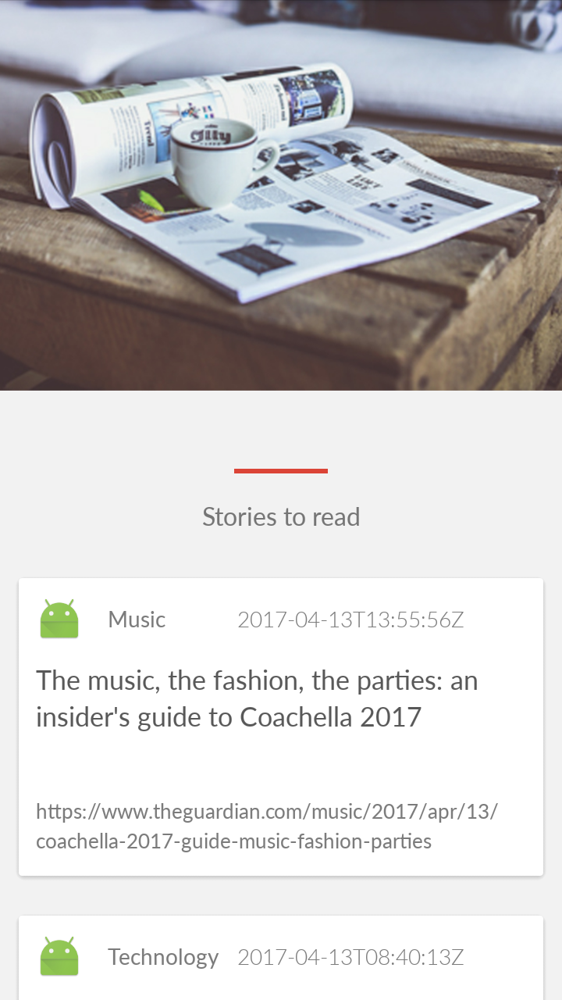
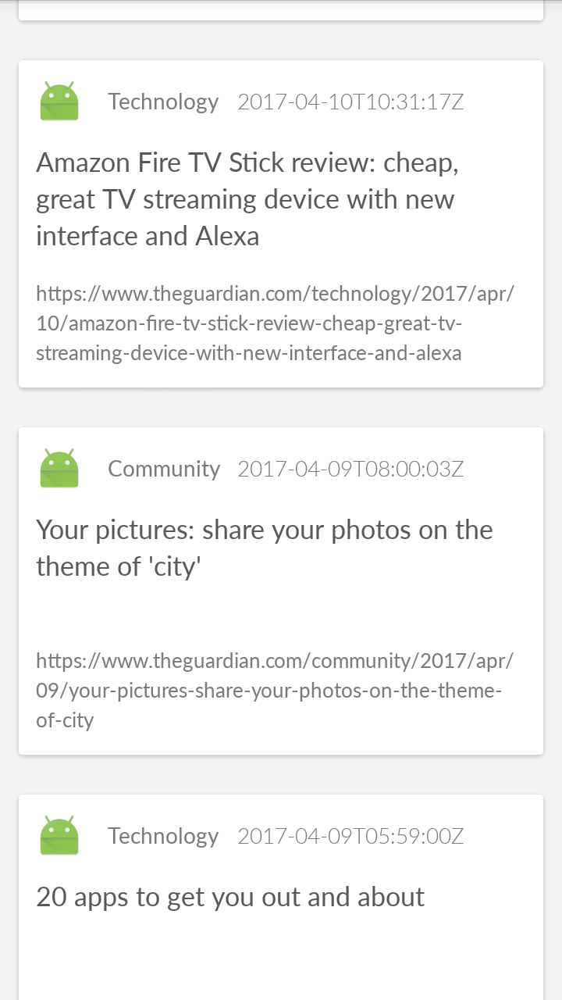
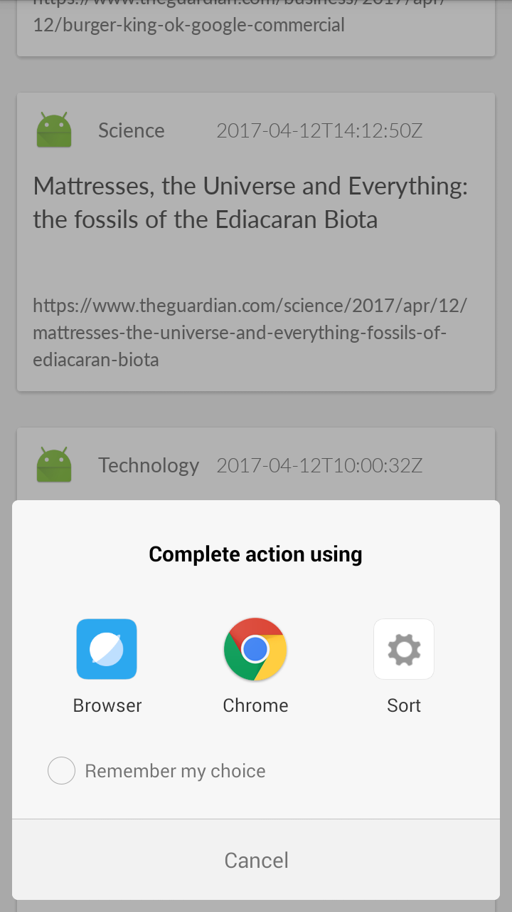

## NewsApp
News feed app which gives a user regularly-updated news from the internet related to a particular topic, person, or location.
Project which comes under Udacity Android Basics Nanodegree Program

## Project Overview
You will be making your own app that connects to the Internet to provide news articles on a topic of your choice. The goal is to create a News feed app which gives a user regularly-updated news from the internet related to a particular topic, person, or location. The presentation of the information as well as the topic is up to you.

## What will I learn?
This project is about combining various ideas and skills we’ve been practicing throughout the course. They include:

1. Connecting to an API
2. Parsing the response of the API
3. Handling error cases gracefully
4. Updating information regularly
5. Doing network operations independent of the Activity lifecycle

## Requirements
To Learn about the Guardian API, take a look at [this page](http://open-platform.theguardian.com/documentation/). Also, try modifying [this example query](http://content.guardianapis.com/search?q=debates&api-key=test) or [this example query](http://content.guardianapis.com/search?q=debate&tag=politics/politics&from-date=2014-01-01&api-key=test).

## Final Output - Screenshots

Screen 1                          |Screen 2
:--------------------------------:|:--------------------------------:
  |

Screen 3                          |Screen 4
:--------------------------------:|:--------------------------------:
  |

## Download
You can download the apk here [NewsApp](../../raw/master/app/screenshots/app-debug.apk)
